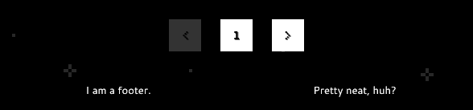
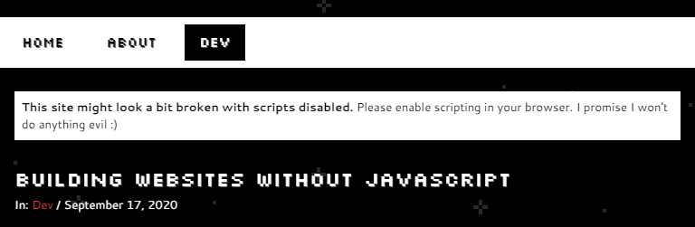
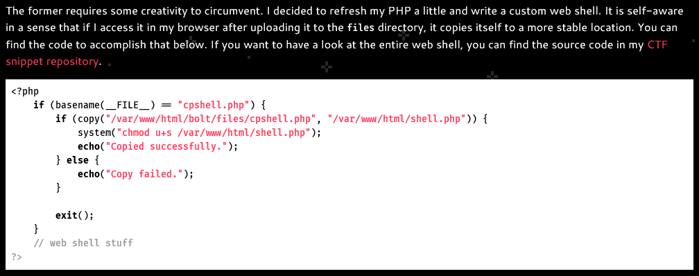

A dead simple [Hugo](https://gohugo.io/) theme that you can see in action over at [my personal website](https://owlspace.xyz/).

## Features

* Completely responsive
* Works without JavaScript
* Custom pagination and asset pipelines
* Automatic menu entries for sections
* Custom menu entries, footer text, CSS and JS
* Optional syntax highlighting that matches the site theme
* OpenGraph and Twitter card integration
* [KaTeX](https://katex.org/) support

## Restrictions

This theme is as simple as it gets. As a result, it doesn't support all features that you'd find in every other Hugo theme out there. The following list shows some common features that aren't included, but might be in the future.

* RSS discovery
* Comments sections
* Table of contents
* Support for taxonomies
* Internationalization
* Nested sections

## Configuration

Clone this repository into the `themes` folder of your site and update your configuration file to use the owlspace theme.

### Menu entries

Setting `sectionPagesMenu` to `main` in your site config automatically inflates the menu with your top sections, sorted alphabetically. Additionally, you can define custom menu entries which are added first to the menu in the order you specify them in. Create a file `nav.toml` in your `data` directory with the following content to get a menu that links to your homepage, your about page, and then your top sections in alphabetical order.

```toml
order = [ "index", "about" ]

[index]
  name = "Home"
  url = "/"

[about]
  name = "About"
  url = "/about/"
```

The `order` field defines the order in which the custom menu items will appear. The array strings must refer to the section names in your navigation file. Every section must contain a `name` which is rendered into the menu and a `url` which points to the desired path relative to the webserver root.

### Custom pagination

In order to use pagination, set `paginate` in your site config to the number of posts you want on one page. This will render a paginator at the bottom of every list page.

### Footer entries

To add custom text to your website footer, create a file `footer.toml` in your `data` directory. Add an array field called `content` and fill it with text that you'd like to appear at the bottom of your page. This field supports Markdown.

```toml
content = [
    "I am a footer.",
    "Pretty neat, huh?"
]
```



The footer automatically wraps on small displays.

### Subheadline

You can include a subheadline that appears under the title of your website by setting the `subtitle` field in your site config. See the banner of this file for an example. If your subheadline should also be included in the OpenGraph description for your website, make sure to also set the `description` field like so.

```toml
[params]
  # Subheading under the page title.
  subtitle = "A Hugo theme made for owls"
  # OpenGraph description
  description = "A Hugo theme made for owls"
```

### Info when scripting is disabled

This theme is built to work just fine without JavaScript enabled. However, you might want to write posts that depend on JavaScript in some way and warn your readers if they block scripts. To define a warning message, set the `noscript` field in the parameter section of your site config. This field supports Markdown.

```toml
[params]
  noscript = "**This site might look a bit broken with scripts disabled.** Please enable scripting in your browser. I promise I won't do anything evil :)"
```

By default, the warning is packaged into a `noscript` element and only displayed on pages that explicitly define `needsjs` in their front matter.

```yaml
---
title: "Building websites without JavaScript"
date: 2020-09-17
needsjs: true
---
```



### Support for KaTeX

Owlspace uses KaTeX's autorendering feature to allow for mathematical notation on your website. As such, scripts must be enabled for this feature to work. Pages that require this feature must include `katex` in their front matter. This enables you to use `$`, `\\(` and `\\)` as delimiters for inline math and `$$`, `\\[` and `\\]` for math displays.

Keep in mind that Hugo's default Markdown rendering engine Goldmark doesn't work well with KaTeX. You should set the `markup` field to `mmark` in your page's front matter for now. This is deprecated and will probably be removed soon, but until then there's hopefully a better workaround.

In conjunction with the previous section, a front matter that allows for math rendering with KaTeX in the browser could look like this.

```yaml
---
katex: true
markup: mmark
needsjs: true
---
```

### Themed syntax highlighting

In order to use the bundled syntax highlighting styles, add the following to the Markup section of your site config. Code blocks will then render as shown below.

```toml
[markup]
  [markup.highlight]
    # Enable custom syntax highlighting.
    noClasses = false
```



### Site theme color

Set `themeColor` in the parameter section of your site config to a valid CSS color string. This will include a `meta` element on your website that causes some browsers to adjust the color of their browser bar to fit the website's theme.

```toml
[params]
  # Theme color.
  themeColor = "#000000"
```

### Custom asset pipelines

The theme provides two empty partials: `custom_css.html` and `custom_js.html`. You can override them in your `layouts/partials` directory and include your own asset pipelines or static files that you want to include in your final website. Custom CSS is inserted in the document head after the main theme stylesheet. Custom JS is inserted at the end of the document body after the theme's responsive menu script.

## License

MIT, see [LICENSE](LICENSE).

The fonts used in this theme fall under their respective licenses.

* [Silkscreen](https://www.kottke.org/plus/type/silkscreen/) by Jason Kottle, OFL 1.1
* [Fira Code](https://github.com/tonsky/FiraCode) by the Fira Code Project Authors, OFL 1.1
* [Cantarell](https://gitlab.gnome.org/GNOME/cantarell-fonts) by the Cantarell Authors, OFL 1.1